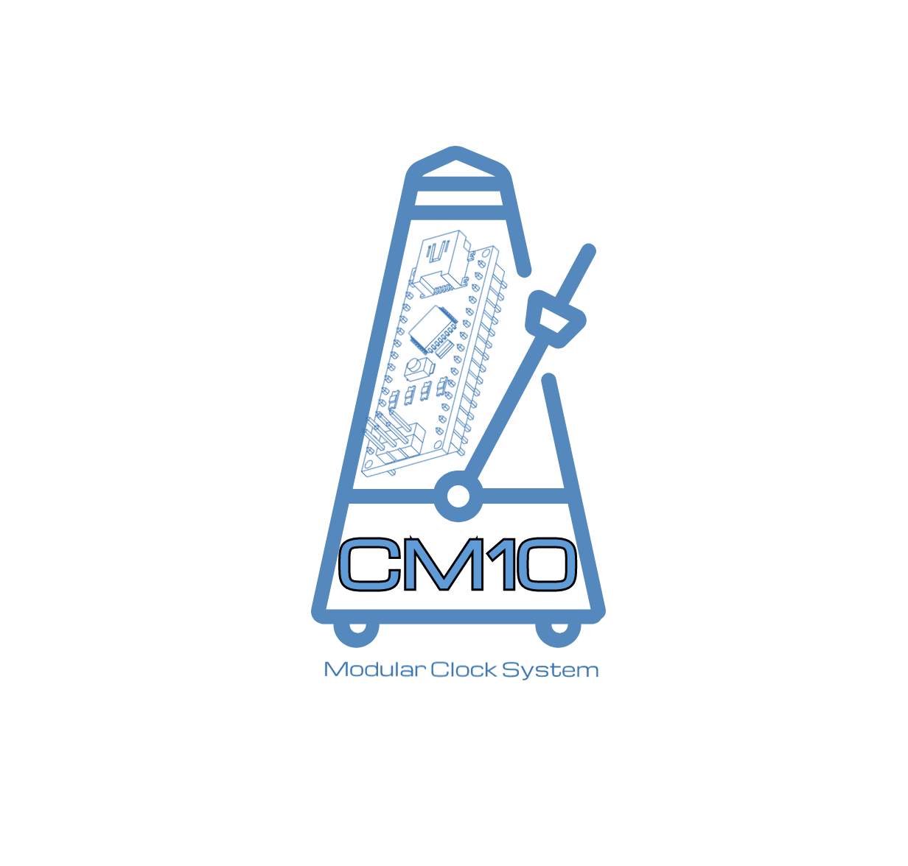

# CM10 Clock - Modular Synth Core Clock
     

 <p align="center">
    
 </p>

A modular synth clock that supports 8 note division outputs, I2C 128x32 OLED display, and SYNC in/out via 24 ppqn (pulse per quarter note) pulses, known as DIN sync.

# Wiring Diagram
TBD

# Clock Design

A large part of this section is for an advanced reader who wants to learn how this clock works.

This modular synth clock was designed to be a reasonably accurate muscical master clock source for CV (control voltage) clock-dependent modules such as sequencers. My goal was to provide a wide range of static divisions of a whole note based on BPM configurable either locally or remotely - including triplet signatures.

While this clock was designed with a locally configurable BPM via analog potentiomer or other varistor input, the clock was designed with MIDI 24PPQN SYNC in mind, thus the focus on 24 PPQN, the [Sync24](https://en.wikipedia.org/wiki/DIN_sync) standard. 24PPQN is reasonably well supported (ex [Arturia Keystep Pro](https://www.arturia.com/faq/keystep/keystep-how-to-synchronize-my-keystep-with-an-analog-clock)) and would allow both the ability to accept a sync signal from an external clock source (such as a keyboard sequencer) while having your synced subdivisions - or send a SYNC out to a dependent such as another clock or some DAWs.

## Hardware
This clock is currently locked into the Arduino Nano architecture/format due to bitbashing port registers that may not be the same on other models or layouts.

#### :: Inputs
* 5v/GND
* A0 - Course BPM Tune
* A1 - Course Pulse Width (Duration) Tune
* D2 (Interrupt) - Rising Interrupt HALT/RESET
* D3 - TBD/Sync IN

#### :: Outputs
* D4 - Sync 24PPQN IN
* D5 - Sync 24PPQN OUT
* D6 - Wholte Note
* D7 - Half Note
* D8 - Triplet
* D9 - Quarter Note
* D10 - Quarter Triplet
* D11 - Eigth Note
* D12 -  Sixteenth Note
* D13 -  Sixteenth Triplet

## Data
The clock data is stored in a `array[96]` of `uint8_t`. Each `uint8_t` represents a single step in the 96 step cycle of a whole note. This is visualized in [static/24ppqn-Subdivisions.pdf](static/24ppqn-Subdivisions.pdf) which was also the data source for determining the step sequence for this project.

note: the pdf defines a 1/32nd note that there were no port registers remaining for.

Each step is a single byte, representing 8 possible divisions of a whole note in binary format (whether or not the signal would fire on that step).

The layout of a byte in `little endian` (least significant bit, but simply - it reads from the "right" visually below in examples) is:

```
 7: 1/1
 6: 1/2
 5: 1/3
 4: 1/4
 3: 1/4-3
 2: 1/8
 1: 1/16
 0: 1/16-3
```

 Each bit represents either a high or low voltage on a corresponding port register. These bytes are written as their whole number counterparts.

 Ex. "all on" like in the 0th step is `255`, or `11111111`.

 Step 6 is `3`, or `00000011`

 If you were to ask for bit 0, you would receive `1` or `HIGH` for 1/16 triplets.

## Bitbashing
In order to main consistency across note divisions, all output ports need to fire at exactly the same time. Due to the nature of a microprocessor, firing multiple `digitalWrite()` commands are not guaranteed or even likely to fire at the same time, drifting depending on the core workload and the ambient temperature of Venus in January. To this end the port states are updated via a technique called `Bitbashing` in which the port registers are updated via casting bits directly to them instead of using the wrapper helper function.

* Pros
    * Each port register (byte representing 8 ports) can be updated instantly (each port receives their state at the same time)
    * Easy to rapidly set state from memory array and cast the generated byte to the register
    * fast enough to maintain the very fast (down to `10ms`) cycle speeds required for higher BPMs like 220BPM.

* Cons
    * Hardware lock in: as it is written, it may (and is really likely) to not work on other arduino models due to variances in port registers and ports themselves. (`digitalWrite()` abstracts and solves this for you)
    * More difficult to read and understand codewise
    * Still have to update the two registers in two steps


#### :: Port Registers
The ports are default configured as defined below


```
D2 (interrupt) - Clock halt & display/Reset (no reboot)
D3 (interrupt) - SYNC IN (TBD)
D4 (T) - SYNC IN (TBD)
D5 (T) - SYNC OUT
D6 (1/1) - Whole Note
D7 (1/2) - Half note
D8 (1/3) - Triplet
D9 (1/4) - Quarter Note
D10 (1/4-3) - Quarter Triplet
D11 (1/8) - Eigth Note
D12 (1/16) - Sixteenth Note
D13 (1/16-3) - Sixteenth Triplet
```

#### :: Casting steps to registers via Bitbashing
These core outputs are bashed codewise with two registers (note index reads right to left)

```
 PORTD = B00000000 = 7, 6, 5, 4, 3, 2, 1, 0
 PORTB = B00000000 = x, x, 13, 12, 11, 10, 9, 8
```

Two bytes are assembled and bitbash to these directly.

```
StepData state = read_step_bytes(count);
PORTD = state.D;
PORTB = state.B;
```

After the pulse duration has expired, they are simply bashed with 

```
PORTD &= B00000000;
PORTB &= B00000000;
```

to bring them low again,

#### :: OLED Display
The clock operates in two primary modes: `running`, and `halted`.

When running, the OLED display is disabled so that the chip's resources can be dedicated to maintaining the clock cycle. However, when the `HALT/REST`button is pressed while in this mode, it switches to `HALTED` mode - wherin the clock is disabled moementarily to dedicate resources to operating the screen. Once pressed again, the clock restarts once more at step 0.

This mode is intended for setting BPM, Duration, and checking SYNC status (but it can also be used to simply stop the clock, or reset it). It is possible to control this HALT/RESET via CV as well by sending one or two `0-5v` voltage no less than 200ms apart (software debounce).

The display can be disabled in the configuration as shown below, and you will not benefit from seeing the set BPM or other details - however the halt/reset will still work.

## Configuration
There are some configuration variables that are set within a header file. Some of these, such as min or max BPM are already configured at the bounds the module has been tested at. Changing these may introduce unexpected behaviors.

However the configuration also allows you to do a few things like set a static BPM/DURATION via `NOIO` which allows for the module to run without potentiometers.

You can also enable/disable `DEBUG` for `Serial` logs (at `111500 that number` FIX ME), or `HAS_SCREEN` to enable or disable the OLED codepaths.

#### :: The Config Header File
Configuration is provided dby [config.h](config.h)

* DEBUG `bool`
    * Enables serial console and streams log
* NOIO `bool`
    * Enable if no potentiometers wired to use a static preset BPM
* NOIO_BPM `int`
    * NOIO static BPM
* NOIO_DURATION `int`
    * NOIO static pulse duration (whole number percentage)
* MIN_BPM `int`
    * Lowest BPM the clock can achieve
* MAX_BPM `int`
    * Highest BPM the clock can achieve
* HAS_SCREEN `bool`
    * Whether a screen is attached/expected
* SCREEN_ADDRR
    * The address of the screen
* Ports (should not be changed unless you know what you are doing)
    * BPM_IN
    * DUR_IN
    * CLOCK_RESE
    * SYNC_I
    * SYNC_OU
    * WHOLE_NOT
    * HALF_NOT
    * TRIPLE
    * QUARTER_NOT
    * QUARTER_TRIPLET
    * EIGTH_NOTE
    * SIXTEENTH_NOTE
    * SIXTEENTH_TRIPLET

# LICENSE
TBD

# Contributing
Contributions are encouraged and welcome.

# Author(s)

* Charles (asciifaceman) Corbett - Originator/Owner
